# Diagrama de Classes

Este documento contém os diagramas de classes do projeto.

---

## 1️⃣ Diagrama: Interfaces

**Descrição**: Interface `Reproduzivel` define o contrato que `Audio` (e subclasses) devem implementar. Junto com `Serializable` e `Comparable`, formam a base de comportamento do sistema.

---

## 2️⃣ Diagrama: Modelos de Mídia (`model.midia`)

- **Herança**: `Musica` e `Podcast` herdam de `Audio`
- **Classe Abstrata**: `Audio` não pode ser instanciada
- **Agregação**: `Musica` referencia `Artista` (artista existe independentemente)
- **Composição**: `Album` contém `Musica`s (faixas pertencem ao álbum)

---

## 3️⃣ Diagrama: Playlist e Usuário (`model.playlist`, `model.usuario`)

**Coleções Utilizadas**:
| Coleção | Classe | Atributo | Justificativa |
|---------|--------|----------|---------------|
| `List<Playlist>` | Usuario | playlists | Mantém ordem de criação |
| `Set<Audio>` | Usuario | curtidas | Evita duplicatas, busca O(1) |
| `List<Audio>` | Playlist | itens | Mantém ordem da playlist |

---

## 4️⃣ Diagrama: Camada de Serviços (`service`)

**Padrão Singleton**: `BibliotecaService` e `UsuarioService` têm instância única acessível via `getInstance()`.

**Coleções dos Serviços**:
| Coleção | Serviço | Uso |
|---------|---------|-----|
| `List<Audio>` | BibliotecaService | Catálogo principal |
| `Map<String, List<Audio>>` | BibliotecaService | Indice de busca rápida |
| `Map<String, Artista>` | BibliotecaService | Cache de artistas |
| `List<Audio>` | PlayerService | Fila de reprodução |
| `Map<String, Usuario>` | UsuarioService | Busca rápida por email |

---

## 5️⃣ Diagrama: Exceções (`exception`)

**Hierarquia**: Todas as exceções da aplicação estendem `BaseAppException`, que por sua vez estende `RuntimeException`.

---

## 6️⃣ Diagrama: Interface de Menu (`menu`)

**Arquitetura**: `MenuPrincipal` é o coordenador central que gerencia a navegação entre submenus após o login. `TelaAutenticacao` é exibida antes do login.

---

## 7️⃣ Diagrama: Visão Geral da Arquitetura

**Arquitetura em Camadas**:
1. **Apresentação** (`menu`): Interface com o usuário via console
2. **Serviços** (`service`): Lógica de negócio e persistência
3. **Modelos** (`model`): Entidades de domínio
4. **Interfaces** (`interfaces`): Contratos de comportamento
5. **Exceções** (`exception`): Tratamento de erros

---

## 8️⃣ Diagrama Completo

